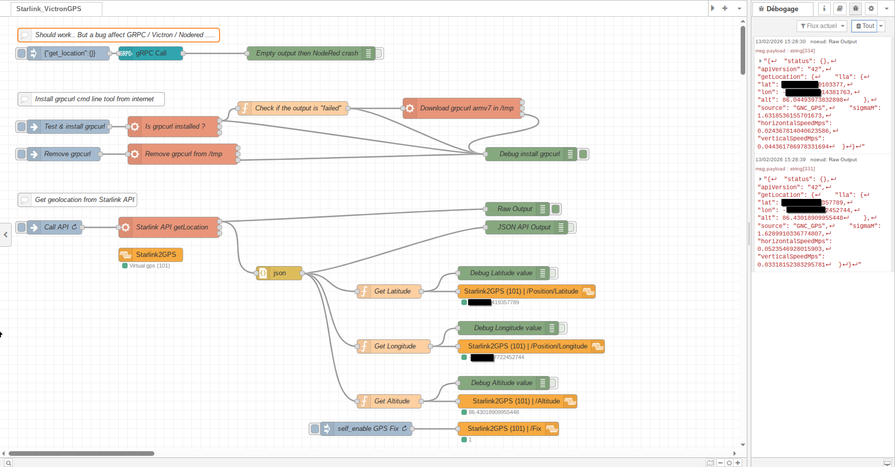

# Nodered_Starlink_VictronGPS

A Node-RED flow that integrates Starlink GPS data with Victron energy systems, providing location awareness for your off-grid or mobile power setup.

## Overview

This Node-RED flow collects GPS coordinates from the Starlink API and makes them available to Victron energy systems. It's particularly useful for:
- Mobile off-grid setups
- Marine applications
- RV/caravan power systems
- Remote installations needing location tracking

## Features

- Fetches GPS coordinates from Starlink API
- Processes latitude, longitude, and altitude data
- Integrates with Victron energy systems via gRPC
- Debug output for troubleshooting
- Automatic installation of required dependencies
- Allow to benefit of Victron's solar forecast

## Prerequisites

- Node-RED installed (v1.0 or newer recommended)
- Victron energy system with Venus OS (v2.80 or newer)
- Starlink dish with active or sleep service
- Enabling "Local Network Access" in Starlink mobile app (version 2022.09.0 or later)
    - SETTINGS -> ADVANCED -> DEBUG DATA -> STARLINK LOCATION -> allow access on local network.
- Local Network connection between Node-RED and:
  - Your Victron system
  - Starlink router/dish

## Installation

1. Import the flow:
   - Copy the contents of `Starlink_VictronGPS.json`
   - In Node-RED, go to Menu → Import → Clipboard
   - Paste the flow and deploy

2. Click on "Test & install grpcurl" flow will attempt to automatically install the required `grpcurl` tool if not present.

3. Every 10sec the flow will populate coordinaate to a Victron's virtual GPS called "Starlink2GPS".

## Configuration

1. **Starlink API Node**:
   - Verify the API endpoint is correct for your Starlink setup
   - Default assumes standard local IP (192.168.100.1)

2. **Victron gRPC Node**:
   - For the moment native gRPC call with node-red-contrib-grpc is bugged... 
   - Default port is 9200 (standard Victron gRPC port)
   - Until NodeRed x Victron x gRPC is not fixed this flow will rely on grpcurl cmdline

3. **Debug Nodes**:
   - The flow includes several debug nodes that can be enabled for troubleshooting
   - Output appears in the Node-RED debug sidebar

## Usage

Once deployed:
1. The flow will automatically fetch GPS data from Starlink every 10sec
2. Process the coordinates & send them to your Victron system
3. If Starlink data are not available, the flow will rely on last valid data
4. Raw output and debug information will appear in the debug tab

## Troubleshooting

**Common Issues**:
- gRPCurl not found: Manual installation may be required (see below)
- Starlink API not responding: Check network connection to Starlink router

# For other systems, download from:
# https://github.com/fullstorydev/grpcurl/releases
